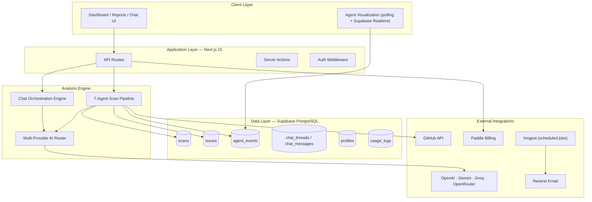
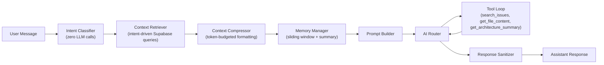

# CortexEDR

[](https://github.com/hamza-hafeez82/cortex-edr/actions/workflows/ci.yml)
[](https://github.com/hamza-hafeez82/cortex-edr/actions/workflows/security.yml)
[](LICENSE)
[](https://nextjs.org/)
[](https://www.typescriptlang.org/)

**AI-powered security auditing platform for modern codebases.**

CortexEDR analyzes GitHub repositories through a multi-agent pipeline, producing structured vulnerability reports, architecture assessments, and a codebase-aware conversational advisor. The system is designed for developers and small teams who need actionable security analysis without enterprise SAST tooling overhead.

**Live:** [cortex-edr.com](https://www.cortex-edr.com) · **App:** [app.cortex-edr.com](https://app.cortex-edr.com)

| | |
|---|---|
| [Architecture](ARCHITECTURE.md) | System design, subsystems, trade-offs |
| [Contributing](CONTRIBUTING.md) | Development workflow and quality gates |
| [Security](SECURITY.md) | Vulnerability disclosure policy |
| [CI/CD](.github/workflows/README.md) | Pipeline documentation and deployment secrets |

---

## Overview

| | |
|---|---|
| **Problem** | AI-assisted development increases shipping velocity; security review often does not keep pace. Traditional SAST platforms are expensive, slow to configure, and opaque. |
| **Approach** | Decompose security analysis into specialized agents coordinated by a synthesis stage. Each agent has a narrow mandate, hardened prompts, and structured JSON output. |
| **Output** | Security score (0–100), CWE/OWASP-classified findings with file/line references, architecture and quality reports, PDF export, and post-scan chat with tool-augmented retrieval. |
| **Scale** | ~29,000 lines of TypeScript across a single Next.js monolith, 9 versioned database migrations, 12 API route groups. |

---

## Architecture

### High-Level System Design



### Design Principles

1. **Specialized agents over monolithic prompts.** Each analysis dimension (security, architecture, quality, debt, AI-generated patterns) runs in isolation with domain-specific system prompts and false-positive guardrails.
2. **Sequential pipeline with shared context.** Agents execute in order; later stages consume earlier outputs stored in Supabase (`recon_data`, `executive_report`, etc.).
3. **Serverless-compatible ingestion.** Repository acquisition uses the GitHub REST API and selective file download — no `git` binary required. This runs on constrained hosting (e.g. Vercel Hobby, Railway).
4. **Tier-gated resource limits.** File count, scan quotas, and model selection are enforced per subscription tier before and during pipeline execution.
5. **Provider-agnostic AI routing.** Primary model selection with a deterministic fallback chain (OpenAI → OpenRouter → Gemini → Groq → DeepSeek) and retry logic for rate limits, timeouts, and network failures.

---

## Scan Pipeline

The core engine lives in `lib/agents/pipeline.ts`. A scan is initiated via `POST /api/scan/start`, which inserts a row and fires `runPipeline()` as a non-blocking background task.

### Agent Stages

| Stage | Agent | Function | AI |
|-------|-------|----------|----|
| 0 | Git Connect | Fetch repo metadata and recursive file tree via GitHub API; enforce tier file limits | No |
| 1 | Reconnaissance | Tech stack detection, dependency mapping, Mermaid architecture diagram, annotated file tree | Yes |
| 2 | Security Scanner | Per-file vulnerability analysis (SQLi, XSS, SSRF, IDOR, hardcoded secrets); CWE/OWASP mapping | Yes |
| 3 | Architecture | Design pattern review, coupling/scalability assessment | Yes |
| 4 | Code Quality | Complexity, duplication, error handling, dead code | Yes |
| 5 | Technical Debt | TODOs, deprecated dependencies, hardcoded values | Yes |
| 6 | AI-Specific | Detection of LLM-generated code patterns and common AI coding mistakes | Yes |
| 7 | Orchestrator | Executive synthesis, security score calculation, final report assembly | Yes |

### Pipeline Flow

```
POST /api/scan/start
  → Validate session + tier quota
  → Insert scan (status: pending)
  → runPipeline() [background]
      → Agent 0: GitHub API tree fetch → /tmp/cortexedr-{scanId}
      → Agent 1–6: Selective file download per step (STEP_PATTERNS) → AI analysis → issues table
      → Agent 7: Synthesize executive_report, compute score → status: completed
      → AILogger persists interaction log to Supabase
      → Cleanup /tmp workspace
```

### Event Streaming

Each agent emits structured events to `agent_events` (`started`, `processing`, `completed`, `issue_found`). The frontend (`hooks/useSSEScan.ts`) polls Supabase and subscribes to Realtime updates to drive the agent canvas visualization.

### Prompt Engineering

Agent prompts (`lib/agents/prompts.ts`) enforce:

- Structured JSON-only responses with schema definitions per agent
- False-positive hardening rules (e.g. security agent requires exact line numbers and code snippets; empty array `[]` when nothing is confirmed)
- Token-bounded input windows (file content truncated to 4–6K chars per call)
- Per-file finding caps to prevent hallucination volume

### AI Observability

`AILogger` (`lib/agents/ai-logger.ts`) records every model interaction during a scan:

- Prompt/response pairs, duration, token counts, estimated cost
- Persisted to Supabase at pipeline completion
- Real-time `usage_logs` inserts for per-user cost analytics

---

## Chat Orchestration Engine

Post-scan, users interact with **Cortex Chat** — a codebase-aware advisor separate from the scan pipeline.

Entry point: `lib/chat/orchestrate.ts`



### Components

| Module | File | Responsibility |
|--------|------|----------------|
| Intent Classifier | `lib/chat/intent-classifier.ts` | Regex-based classification into 9 intents (vulnerability detail, fix guidance, repo overview, etc.) without an LLM call |
| Context Retriever | `lib/chat/context-retriever.ts` | Fetches only data relevant to the classified intent — issues, scan metadata, architecture reports |
| Context Compressor | `lib/chat/context-compressor.ts` | Formats retrieved data within per-intent token budgets (50–3000 tokens) |
| Memory Manager | `lib/chat/memory-manager.ts` | 10-message sliding window with compressed summary of older history |
| Tool Loop | `lib/chat/tools.ts` | Agentic tool calls: issue search, live file fetch from GitHub, architecture summary retrieval |
| Sanitizer | `lib/chat/sanitizer.ts` | Output filtering before persistence |

Tool loop budgets vary by intent (2–7 iterations). Vulnerability and fix-guidance queries receive the highest iteration allowance.

---

## Technology Stack

| Layer | Technology | Version |
|-------|------------|---------|
| Framework | Next.js (App Router, RSC) | 15.4.10 |
| UI | React, TypeScript, Tailwind CSS | React 19, TS 5 |
| Database | Supabase (PostgreSQL + RLS) | — |
| Auth | NextAuth.js (JWT sessions) | 4.24 |
| Payments | Paddle (webhook-verified subscriptions) | — |
| Email | Resend (transactional) | — |
| Background Jobs | Inngest (billing reminder cron) | — |
| PDF Reports | @react-pdf/renderer | — |
| Documentation | Nextra | 4.6 |
| CI | GitHub Actions (lint + build) | Node 20 |

### AI Providers

| Provider | Usage |
|----------|-------|
| OpenAI | Primary models (GPT-4o, GPT-4o-mini); tier-mapped per agent |
| OpenRouter | DeepSeek R1 and fallback model routing |
| Google Gemini | Secondary fallback |
| Groq | Emergency fallback (Llama 3.1/3.3) |
| DeepSeek | Direct API fallback |

Model selection is tier-dependent (`lib/agents/openrouter-config.ts`, `lib/config/system.ts`). Higher tiers route security and synthesis agents to GPT-4o; free tier uses GPT-4o-mini across all agents.

---

## Database Schema

Nine versioned migrations in `supabase/migrations/`:

| Migration | Module | Key Tables |
|-----------|--------|------------|
| 001 | Core Auth | `users`, auth triggers |
| 002 | Identity | `profiles` (plan tier, scan quotas) |
| 003 | Scanning Engine | `scans`, `issues`, `agent_events`, `repositories` |
| 004 | Chat | `chat_threads`, `chat_messages`, `chat_shares` |
| 005 | Financial Ops | `payment_history`, `payment_submissions`, `billing_invoices` |
| 006 | Optimizations | Realtime publication, composite indices, data purge functions |
| 007 | Admin | Admin sudo, tier management |
| 008–009 | Maintenance | Profile column fixes, tier name sync |

All user-facing tables have Row-Level Security enabled. Service-role client is used server-side for pipeline writes and webhook handlers.

### Key `scans` Columns

```
status          pending | running | completed | failed
current_agent   0–7 (live progress tracking)
executive_report, enterprise_report, recon_data  (JSONB)
severity_counts, issue_counts                    (JSONB)
architecture_map, application_story, strengths   (TEXT/JSONB)
```

---

## API Surface

| Endpoint | Method | Auth | Purpose |
|----------|--------|------|---------|
| `/api/scan/start` | POST | Session | Initiate scan, enforce quota, trigger pipeline |
| `/api/scan/status/[id]` | GET | Session | Poll scan progress |
| `/api/scan/results/[id]` | GET | Session | Fetch completed report |
| `/api/scans` | GET | Session | List user scan history |
| `/api/chat` | GET/POST | Session | Thread management and message exchange |
| `/api/chat/message` | POST | Session | Alternative chat message endpoint |
| `/api/webhooks/paddle` | POST | Signature | Subscription lifecycle events |
| `/api/inngest` | POST | Inngest | Background job handler |
| `/api/admin/*` | Various | Admin | Tier and user management |

Protected routes are enforced by NextAuth middleware (`middleware.ts`): `/dashboard/*`, `/chat/*`, `/api/scan/*`, `/api/chat/*`.

---

## Security Posture

### Implemented

- **Authentication:** NextAuth.js with GitHub OAuth, Google OAuth, and bcrypt-hashed credentials. JWT sessions (30-day max age).
- **Authorization:** Supabase RLS on all user data. Admin routes gated by `requireAdmin` middleware.
- **Input validation:** Zod schemas for email, password, OTP, scan IDs, redirect URLs (`lib/security/inputValidation.ts`).
- **Webhook verification:** Paddle signature validation via SDK `unmarshal()`.
- **Audit logging:** Structured JSON audit events with sensitive field redaction (`lib/security/auditLog.ts`).
- **Chat sanitization:** AI response filtering before persistence.
- **Environment validation:** Fail-fast startup checks with entropy requirements for secrets (`lib/config/env-validator.ts`).
- **Responsible disclosure:** Documented in [SECURITY.md](SECURITY.md) (48h acknowledgment, 14-day patch target).

### Known Limitations

| Area | Current State |
|------|---------------|
| Rate limiting | In-memory sliding window (`lib/security/rateLimit.ts`). Not distributed — suitable for single-instance deployments. |
| Scan execution | Fire-and-forget in the API process. No dedicated job queue for scans (Inngest handles billing cron only). |
| Audit logs | Written to stdout JSON. Persistent `audit_logs` table not yet implemented. |
| Private repositories | Public repos only. `GITHUB_TOKEN` improves rate limits but does not enable private repo access yet. |
| Automated tests | No test suite in CI. Pipeline validated through lint + production build. |

These are documented trade-offs for an MVP-stage SaaS, not oversights.

---

## Subscription Tiers

Defined in `lib/config/system.ts`:

| Tier | Price | Scans/Month | Notable Limits |
|------|-------|-------------|----------------|
| SCOUT | Free | 20 | Watermarked PDF, basic AI prompts |
| SENTINEL | $9/mo | 15 | Fix suggestions, 1,000 files/scan |
| GUARDIAN | $49/mo | 50 | API access, execution-ready prompts, 5 seats |
| FORTRESS | $299/mo | 500 | Premium models, unlimited files |

Quota enforcement occurs at scan initiation. Paddle webhooks sync subscription state to `profiles`.

---

## Project Structure

```
cortex-edr/
├── app/
│   ├── api/                  # REST endpoints
│   ├── dashboard/            # Scan management, billing, analytics, settings
│   ├── docs/                 # Nextra documentation site
│   ├── legal/                # Privacy, compliance, refund policies
│   └── auth/                 # Login, OAuth callbacks, sign-out
├── components/
│   ├── scan/                 # AgentCanvas, ActivityFeed, live visualization
│   └── report/               # Issue cards, PDF generation, Mermaid diagrams
├── lib/
│   ├── agents/               # Pipeline, prompts, AI router, interaction logger
│   ├── chat/                 # Orchestration engine (6 modules)
│   ├── repo/                 # File tree parser, GitHub cloner (fallback)
│   ├── security/             # Rate limiting, validation, audit logging
│   ├── ai/                   # Provider wrappers (OpenAI, Gemini, Groq, DeepSeek)
│   ├── auth/                 # NextAuth config, admin middleware
│   ├── config/               # Tier definitions, env validation
│   ├── email/                # Resend templates
│   └── inngest/              # Scheduled billing reminders
├── hooks/                    # useSSEScan (real-time agent state)
├── supabase/migrations/      # Versioned schema (001–009)
└── .github/workflows/        # CI pipeline
```

---

## Development

### Prerequisites

- Node.js 20+
- Supabase project (PostgreSQL + Auth)
- API keys for at least one AI provider (OpenAI recommended)
- Resend account (email)
- Paddle account (billing — optional for local dev)

### Setup

```bash
git clone https://github.com/hamza-hafeez82/cortex-edr.git
cd cortex-edr
npm install
cp .env.example .env.local
```

Fill in `.env.local` with your credentials (see comments in `.env.example`).

Apply database migrations:

```bash
# Run migrations 001–009 against your Supabase project
# via Supabase CLI or SQL editor
```

Start the development server:

```bash
npm run dev
```

### Scripts

| Command | Description |
|---------|-------------|
| `npm run dev` | Start Next.js dev server |
| `npm run build` | Production build |
| `npm run start` | Start production server |
| `npm run lint` | ESLint |
| `npm run typecheck` | TypeScript compiler check |
| `npm run ci` | Full quality gate (lint + typecheck + build) |

### CI/CD

Three GitHub Actions workflows run on every push and pull request to `main`:

| Workflow | Jobs | Purpose |
|----------|------|---------|
| **CI** | Lint → Typecheck → Build | Quality gate with build artifact upload |
| **Security** | npm audit, Gitleaks, CodeQL | Dependency, secret, and static analysis |
| **Deploy** | Production build → Railway | Auto-deploy after CI passes on `main` |

```
PR / Push ──▶ CI (lint, typecheck, build)
                │
                ▼ (main only, on success)
             Deploy (Railway)
```

Weekly security scans run every Monday. Dependabot opens PRs for npm and Actions updates.

See [.github/workflows/README.md](.github/workflows/README.md) for deployment secrets and environment setup.

---

## Engineering Decisions

Decisions worth noting for reviewers evaluating systems design:

**Why multi-agent instead of one large prompt?**
Single prompts degrade on large codebases — context windows fill with irrelevant code, and the model conflates security, architecture, and style concerns. Specialized agents with narrow mandates produce higher-precision findings and allow per-agent model selection (e.g. reasoning models for security, fast models for reconnaissance).

**Why GitHub API over git clone?**
Serverless and hobby-tier hosting often lacks a `git` binary and persistent filesystem. The API approach fetches only files needed per agent step (up to 100 per step, pattern-filtered), reducing I/O and memory. A `.cortex-tree` manifest preserves the full virtual file list for agents that need structural awareness without downloading every blob.

**Why regex intent classification for chat?**
LLM-based intent routing adds latency and cost to every message. Pattern matching against 9 intent categories with confidence scoring eliminates that overhead for the common case. The classifier extracts keywords used by the context retriever to scope database queries.

**Why token-budgeted context compression?**
Dumping all scan issues into every chat prompt wastes tokens and dilutes relevance. Per-intent budgets (50 tokens for metadata, up to 3,000 for fix guidance with full file content) keep prompts focused and costs predictable.

**Why fire-and-forget pipeline execution?**
Scan initiation returns immediately with a `scan_id`. The pipeline runs asynchronously in the same Node process. This avoids blocking the HTTP response for 2–5 minutes. Trade-off: no retry queue if the process crashes mid-scan. A dedicated job queue (Inngest, BullMQ) is the natural next step for production hardening.

---

## Research Foundation

The multi-agent orchestration model draws from **Project Cortex** — research on prefrontal-cortex-inspired AI architecture where specialized modules are coordinated by an executive controller with shared memory and hierarchical task decomposition.

CortexEDR is a production application of that model applied to automated security analysis: each agent maps to a cognitive function, the orchestrator synthesizes outputs, and `agent_events` + Supabase JSONB columns serve as shared working memory.

---

## Roadmap

| Status | Feature |
|--------|---------|
| Shipped | 7-agent scan pipeline, live visualization, Cortex Chat, PDF export, Paddle billing, tier gating |
| Shipped | Multi-provider AI routing, usage analytics, billing reminder cron |
| In progress | Referral system |
| Planned | Private repository support, GitHub Actions integration, `.cortex-ignore` selective scanning |
| Planned | Distributed rate limiting, dedicated scan job queue, persistent audit log table |
| Planned | IDE plugins (VS Code, Cursor) |

---

## Engineer

Hamza Hafeez is a Software Engineer and AI Systems Researcher focused on building intelligent, production-grade software at the intersection of artificial intelligence, cybersecurity, and distributed systems. His work emphasizes multi-agent architectures, secure software engineering, and developer tooling, with a particular interest in translating AI research into practical systems that solve real engineering problems.

He is the founder of Upvista Digital and the author of Project Cortex, a research initiative exploring prefrontal-cortex-inspired multi-agent AI architectures. CortexEDR represents the production application of that research, combining AI orchestration, modern web engineering, and automated security analysis into a scalable platform for developers.

- Website: https://www.cortex-edr.com
- LinkedIn: https://linkedin.com/in/hmza-hb
- GitHub: https://github.com/hmza-hb

---

## License

MIT

---

## Contributing

Issues and pull requests are welcome. See [CONTRIBUTING.md](CONTRIBUTING.md) for the development workflow, quality gates, and code standards.

For security vulnerabilities, follow the process in [SECURITY.md](SECURITY.md) — do not open public issues for security reports.
